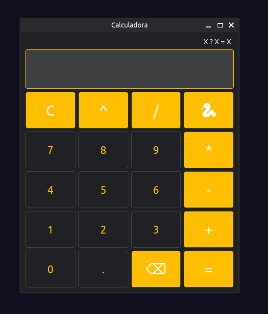

# calculadora_lh
Projeto calculadora em Python, usando a biblioteca PySide6, do curso de <a href="https://www.udemy.com/course/python-3-do-zero-ao-avancado/">Python do Otávio Miranda</a> 
# Como rodar
Instale os requisitos: `pip install -r requirements.txt`

Para executar: `python main.py`
# Preview

